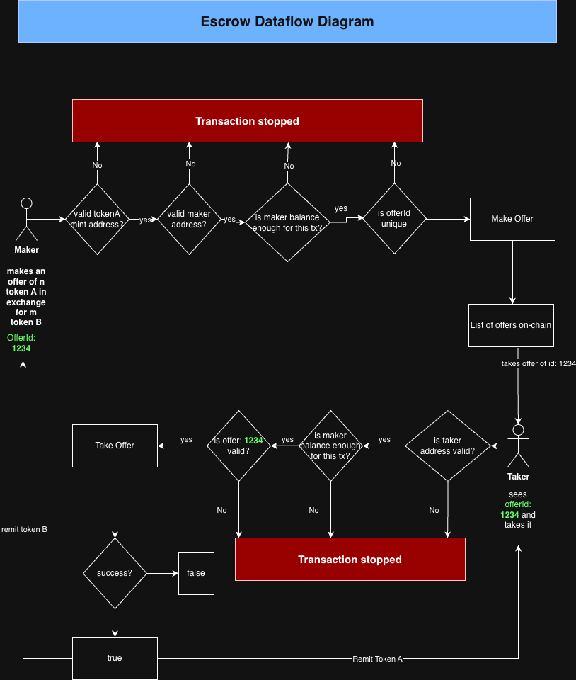
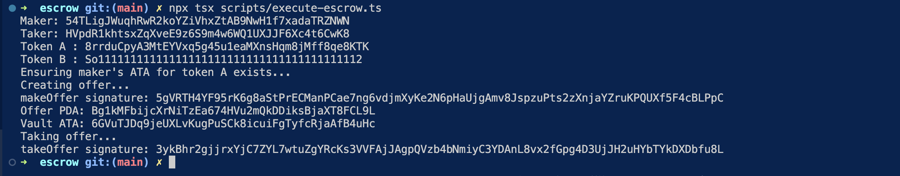

# Escrow

## Introduction

This program allows a user(maker) to offer up a trade of **A** tokens at price **x** in exchange for token **B** and if another user(taker) sees and likes the offer, accepts and takes the exchange and respective tokens are transferred to each user.

When the maker makes an offer, the token X from the makers wallet are stored in a vault. When a taker likes the offer and takes it, the funds are unlocked from the vault and sent to the taker. Also, token Z from the takers wallet are transferred to the maker. In the process the vault and the offer are deleted.

All these done without the need for a middleman :-D

## Escrow Dataflow Diagram



## How to use the escrow.

1. Clone the repo
2. cd into the repo and run:-
```bash
$ npm install
```
3. Build the project
```bash
$ anchor build
```
4. Before running the escrow script, set up maker and taker wallets. You can create them on termial:-
```bash
$ solana-keygen new -o maker.json # maker wallet
$ solana-keygen new -o taker.json # taker wallet
```
6. Fund the wallets
7. Export X's(maker) mint public key:-
```bash
$ export MINT_A_PUBLIC_KEY="8rrduCpyA3MtEYVxq5g45u1eaMXnsHqm8jMff8qe8KTK"
```
8. Fund both wallets with some lamports so as to execute transactions. Make sure you transfer different SPL tokens that you want to trade to both wallets.
9. Run the script to execute the escrow:-
```bash
$ npx tsx scripts/execute-escrow.ts
```

**Make Offer TX hash**: hash after maker makes the offer - 4my6FtRaShxm13fCuRLHmtAKifRX37tuYZgXybhY3CT9KDF8BX8tm6S4js5raQkotfEjMdAkL4KQ4YZ9W1GxXJHB
**Take Offer TX hash**: has after taker takes the offer - 3qNmfLenpVko87vUnsFn7AmJYw1x5SVfqW8yUv9fi3Kxo6ZyiwcCaU3rphHWDwoPDGca9ccxRcGir2w3oxhkCT26

